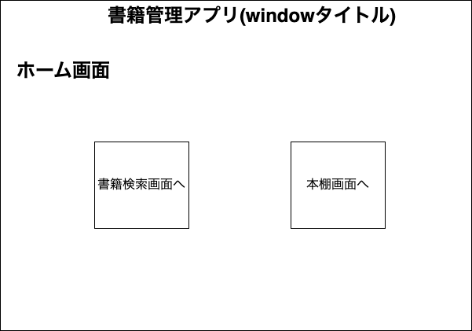
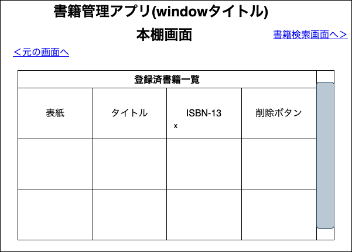

# 自由課題共有用
図などの画像資料はimgフォルダに保存してください。
## 仕様案
書籍管理アプリ
- 本の検索機能
  ->googlebooksAPIを使用した検索方法　閲覧サイトURL(https://python-muda.com/python/api-book-search-ep1/)
  ->ISBNを使用してなら検索可能？
  閲覧サイトURL(https://qiita.com/takafi/items/10749288cca771d340a8)
  (https://labo.kon-ruri.co.jp/google-books-apis/)
- 本の登録機能
->多分できる
- 本の表紙は画像表示したい
->できると思うけど、たまに違う画像が表示される場合もあるらしい。閲覧サイトURL(https://fight-tsk.blogspot.com/2014/10/google-book-apijavascript.html)
- 持っている本の管理
->
- 本のお気に入り機能
->
- 読んでない本のカウント
->
- 読書記録
->APIを利用して多分可能？参考になる？
閲覧サイト(https://tech-memo.yonayona.biz/posts/google-books-api)
- しおり機能
->
- 本の画像から検索
->やっぱ多分できるかもです。閲覧サイト(https://qiita.com/takafi/items/10749288cca771d340a8)
- 読書時間をページ数で予測
->本の種類ごとの１ページあたりの文字数から逆算可能（ただし、正確な文字数ではないため概算になる）
  閲覧サイトURL(https://www.pc-sokudoku.co.jp/kouza/kokugo/kyohon29.html)

## 作業分担
リーダーがサポートに回る<br>
グループで機能の実装を行う<br>
2人グループ:辰野新之助画面実装、小田切善慈郎機能実装  本棚画面機能  JSONファイルからデータを読み込んでリスト表示<br>
2人グループ:清水綾太画面実装、運天一帆機能実装  詳細画面機能ホーム画面実装  書籍データの詳細データの表示<br>
3人グループ:柘植蒼眞画面実装、杉下綾香機能実装、川村真生画面実装  検索画面機能  APIを使用して書籍の検索、検索結果のリスト表示、書籍のお気に入り機能（JSONファイルに保存）<br>

| 氏名      | 学籍番号     | 担当作業 |
| -------------- | ----------- |------ |
| 木村友亮 | K21231 |作業割り当て、ドキュメント作成、PullRequest確認、動作確認、その他|
| 川村真生 | K22043 |画面設計清書|
| 杉下綾香 | K22071 |検索機能実装|
| 柘植蒼眞 | K22089 |検索画面実装|
| 運天一帆 | K22022 |詳細画面の機能実装|
| 清水綾太 | K22066 |詳細画面実装|
| 小田切善慈郎 | K22031 |本棚機能実装|
| 辰野新之助 | K22085 |本棚画面実装|


## 命名規則
- このサイトに記載されている命名規則に則る(https://qiita.com/naomi7325/items/4eb1d2a40277361e898b)
- ファイル名は最初大文字 + 大文字区切り
- 

## 書籍管理アプリ仕様書
目的 : 持っている本の管理がしたい
利用者像 : 書籍の管理をしたい人
PC用GUIアプリ

## 使用ライブラリ
| ライブラリ | バージョン | 備考 |
| ---------- | ---------- | ---- |
| Tkinter    |            |  GUI実装に使用    |
| json       |            |  JSONデータを扱うために使用    |
| requests   |            |   GoogleBooksAPIにアクセスするために使用   |


## システム機能一覧
- 書籍検索機能
- 書籍登録機能
- 登録済み書籍削除機能
- 書籍一覧表示機能
- 書籍詳細表示機能
- JSONファイル書き込み機能
- JSONファイル読み取り機能

## 画面一覧
- ホーム画面 
- 書籍検索画面 
- 本棚画面
- 書籍詳細画面

## 画面遷移図


## ホーム画面 : HomeScreen

- 画面遷移機能のみを持つ画面
- ボタン２つを配置する
- 書籍検索画面へ遷移するボタン : book_search_screen_button
- 本棚画面へ遷移するボタン : book_shelf_screen_button

## 書籍検索画面 : BookSearchScreen

- 書籍の検索機能と検索結果一覧表示機能を持つ画面
- 検索ボックスとして使用するテキストボックス : book_search_textbox
- 検索ボックスに入力された文字列で検索を開始するボタン : book_search_button
- 検索内容：書籍タイトル 、ISBN、著者
- 検索結果を表示するテーブル : search_result_table
- テーブルに対してスクロールバーを配置する
- テーブルの列名は[表紙],[タイトル],[ISBN],[登録ボタン]
- 登録ボタンを押すと押した行の書籍情報がJSONファイルに保存する : add_button
- 表紙列に表示する画像を押すと押した行の書籍情報を書籍詳細画面へ渡し、書籍詳細画面へ遷移する 
テーブル例

| 表紙画像  | タイトル  | ISBN-13 | 空白 |
| --------- | --------- | ------------- | ---------- |
| 表紙画像1 | タイトル1 | 1234567891234 | 登録ボタン |
| 表紙画像2 | タイトル2 | 1234567891234 | 登録ボタン |
| 表紙画像3 | タイトル3 | 1234567891234 | 登録ボタン |
| 表紙画像4 | タイトル4 | 1234567891234 | 登録ボタン |

## 本棚画面 : BookshelfScreen

- 登録した書籍情報を一覧表示する画面
- JSONファイルから読み込んだ内容を表示するテーブル : bookshelf_table
- テーブルに対してスクロールバーを配置する
- テーブルの列名は[表紙],[タイトル],[ISBN],[登録解除ボタン]
- 登録解除ボタンを押すと押した行の書籍情報がJSONファイルから削除される : delete_button
- 表紙列に表示する画像を押すと押した行の書籍情報を書籍詳細画面へ渡し、書籍詳細画面へ遷移する
テーブル例

| 表紙画像  | タイトル  | ISBN-13 | 空白 |
| --------- | --------- | ------------- | ---------- |
| 表紙画像1 | タイトル1 | 1234567891234 | 削除ボタン |
| 表紙画像2 | タイトル2 | 1234567891234 | 削除ボタン |
| 表紙画像3 | タイトル3 | 1234567891234 | 削除ボタン |
| 表紙画像4 | タイトル4 | 1234567891234 | 削除ボタン |

## 書籍詳細画面 : BookDetailsScreen

- 書籍の詳細情報を表示する画面
- 書籍検索画面または、本棚画面のテーブルの表紙列の画像を押した時にこの画面へ遷移する
- 遷移する際、書籍の情報を渡される

### GoogleBooksAPIで所得するデータ
- 書籍タイトル
- ISBN-13
- 著者
- ページ数
- 出版日
- 出版社
- 要約
- 書籍の表紙画像(URL形式で取得) 
GoogleBooksAPIでのデータ取得時のJSONデータはkeyは同じだが、書籍によって階層が異なる場合があるためネストされたデータを辿る必要がある

**書籍情報を保存するJSONファイル : Bookshelf.json**
JSONデータの保存形式
```
{
'title': title,#タイトル
'isbn_13': isbn,#ISBN-13コード
'authors': authors,#著者
'published_date': published_date,#出版日
'page_count': page_count,#ページ数
'description': description,#要約
'publisher': publisher,#出版社
'cover_image_url': cover_image_url#画像URL
}
```
データ例
```
{
"title": "リーダブルコード",
"isbn_13": "9784873115658",
"authors": [
"Dustin Boswell",
"Trevor Foucher"
],
"published_date": "2012-06",
"page_count": 237,
"description": "読んでわかるコードの重要性と方法について解説",
"publisher": "O'Reilly Media, Inc.",
"cover_image_url": "http://books.google.com/books/content?id=Wx1dLwEACAAJ&printsec=frontcover&img=1&zoom=1&source=gbs_api"
}
```

## 実装の参考になりそうなサイトなど
PythonでのTkinter、GoogleBooksAPIに関するサイトをまとめました。
GoogleBooksApiTest.pyにGoogleBooksAPIのテストコードを書いておきました。
取得したデータはBookselfTest.jsonに保存してあります。
モジュール化 : 第3回講義資料、JSONデータの扱い方 : 第2回講義資料
- **PythonでTkinterを使ってめちゃくちゃ簡単にGUIアプリを作る**<br>
https://daeudaeu.com/python_tkinter/
- **Tkinterで画面切り替え・画面遷移**<br>
https://qiita.com/seisantaro/items/74ed83fec3d126553245
- **tkinterで画像を表示させる**<br>
https://betashort-lab.com/%E3%83%97%E3%83%AD%E3%82%B0%E3%83%A9%E3%83%9F%E3%83%B3%E3%82%B0/python/tkinter%E3%81%A7%E7%94%BB%E5%83%8F%E3%82%92%E8%A1%A8%E7%A4%BA%E3%81%95%E3%81%9B%E3%82%8B%E6%96%B9%E6%B3%95/
- **【Python】tkinter：テーブル（表）の作成方法（ttk.Treeview）**<br>
https://office54.net/python/tkinter/ttk-treeview-table
- **GoogleBooksAPIリファレンス**<br>
https://developers.google.com/books/docs/v1/using?hl=ja
- **GoogleBooksAPIを使う**<br>
https://qiita.com/frost_star/items/71ed64e1d040a7911c06
- **GoogleBooksAPIを活用して、検索ツールの作成**<br>
https://www.mogura-lab.com/330/
- **Pythonで検索してみよう ~Google Books APIを使ってみる ep1~**<br>
https://python-muda.com/python/api-book-search-ep1/

## 開発する時やって欲しいこと
- 使用したライブラリとバージョンの報告`print(ライブラリ名.__version__)`で確認できます
- コメントの記述
	- 動作説明
	- 関数の使い方
	- 変数の使用用途
